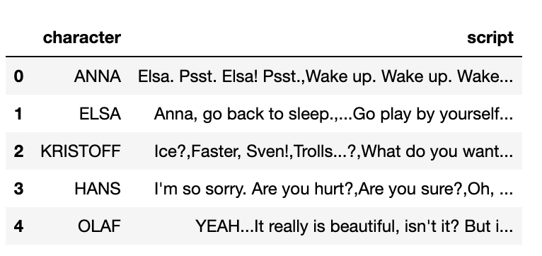
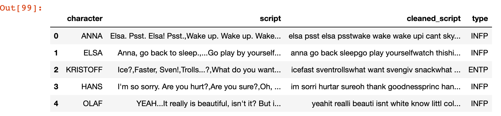
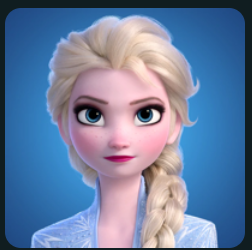
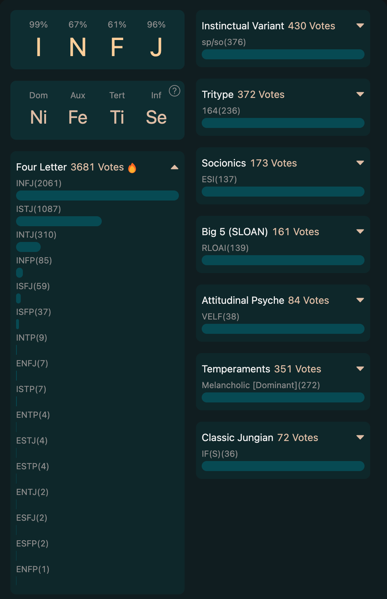

# Myers-Briggs Type Indicator of Movie Characters

Author: Haoyu Yan, Li Liu

## Dataset
Train data:
<ul>
    <li>
        <a href="https://www.kaggle.com/datasets/zeyadkhalid/mbti-personality-types-500-dataset?resource=download">MBTI Personality Types 500 Dataset </a>
    </li>
    <li>
        <a href="https://www.kaggle.com/datasets/datasnaek/mbti-type">(MBTI) Myers-Briggs Personality Type Dataset</a>
    </li>
</ul>

Test data:

download from <a href="https://imsdb.com/">The Internet Movie Script Database (IMSDb)</a>
1. [Frozen](Frozen_script.txt)
2. [Avengers: Endgame](Avengers_Endgame.pdf)

## Tasks
<ul>
    <li>Task1: Product the best model to predict the MBTI type of movie charaters using the train data</li>
    <li>Task2: Parse the movie scripts to generate the test data that we can use to predict</li>
    <li>Task3: Generate predictions for the movie characters in the test data that generated form task2.</li>
</ul>

## Models
### MBTI 500
[MBTI-500.ipynb](MBTI-500.ipynb)
<ol>
    <li>Download, read the data. Check the number of rows, columns and expalin the understanding of the data. Then check are there any null posts in the data?</li>
    <li>Visualize the MBTI type distributions.</li>
    <li>Process the data by removing stop words, strmming words, and extracting linguistic features such as word frequency.</li>
    <li>Create bar charts of the top 20 words of all types. Then utilize wordcloud, a data visualization technique to present textual data in a visual and interactive manner, displays a collection of words, where the size of each word represents its frequency or importance in the given text.</li>
    <li>Create a new column in the dataset containint cleaned reviews. This column will be used for training and testing. Use Counter-Vectorizer and TfidfVectorizer to extract feature and split the training(80%) and testing(20%) datasets.</li>
    <li>Create a model using <b>Naive Bayes</b> get an accuracy of:
    <pre><code>print("Accuracy", accuracy_score(test_y, hyp))
Accuracy Accuracy 0.3214706575536177</code></pre></li>
    <li>Create a model using <b>Random Forest</b> get an accuracy of:
    <pre><code>print("Accuracy", accuracy_score(test_y, hyp))
Accuracy 0.7105821352816404</code></pre></li>
    This one takes about 5+ hours.
    <li>Create a model using <b>SVM</b> get an accuracy of:
    <pre><code>accuracy = accuracy_score(test_y, pred)
print(accuracy)
0.7925995757718596</code></pre></li>
</ol>

## Generate Test Data
Firstly, we run a python script to parse the movie scripts, then we have two output files, they are 'Advengers_Endgame_parsed.txt' and 'Frozen_script_parsed.txt'.

Secondly, we write two python program, 'parse_frozen.py' and 'parse_endgame.py' which will read the parsed file, and collect the scriopts of each character, store the result into output files. The out files are  csv
files. The file has a header row "character" and "script". The example of the test data is shown below:

</img>

## Predictions

The follwing websites provides personality profiles of characters from various media, including movies, TV shows, books, and more.

https://www.personality-database.com/search?keyword=Frozen
It likely provides information about the characters' personalities, traits, and other related details based on user-contributed data.

The following shows our predictions of Frozen:

</img>

Take Elsa for example:

</img>

Based on our model Elsa is INFP. 
But on the website, the votes shows: 
the highest vote is INFJ, then the seconded highest is ISTJ, the third vote is INTJ, the fourth vote is INFP...
</img>

We think it all makes sense. Because the MBTI type is only a theoretical model, and the shaping and performance of characters are often determined by the subjective interpretation of creators and screenwriters. Everyone's understanding and perspective on roles will also vary due to personal experiences and prejudices. Therefore, when understanding and interpreting roles, we need to keep an open mind and realize that MBTI type is not an absolutely accurate and conclusive criterion.

## Credits
The script for parsing the movie scripts come from this paper: Linguistic analysis of differences in portrayal of movie characters, in: Proceedings of Association for Computational Linguistics, Vancouver, Canada, 2017 and the code can be found here: https://github.com/usc-sail/mica-text-script-parser